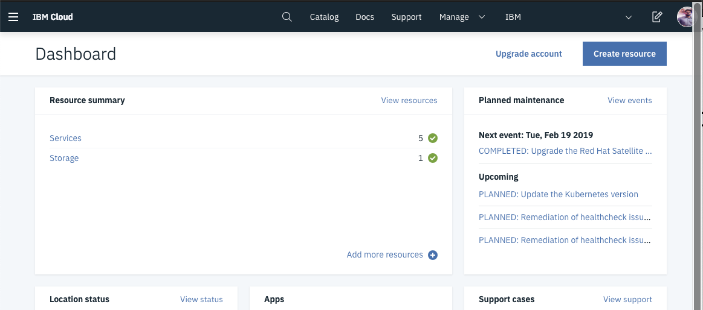

# Twilio

* Sign Up for twilio. [https://www.twilio.com/try-twilio](https://www.twilio.com/try-twilio)
* In the create a project window change tab to select product.
* Select Programmable SMS and go in the bottom to select next.
* Give the project a name and skip the rest of the step.
* If you select the second tab on the left, you will see something like this

* By default the trial accounts in twilio can only send message to verified numbers. This means you could make your app and try it out yourself. But you won't be able to send other people messages. This is fine for our need. 
* Click on `Get Started`
* Click on `Get a Number`
* This will automatically assign a number for you. Choose the number or search for a different number if you want. Once you are happy `Choose this Number` to confirm.
* Click on SMS on the second left nav bar. You should see something like this.

* Click on `Create new Messaging Service` . Give it a name and for Use case select mixed.
* Check the `PROCESS INBOUND MESSAGES` box. The would show two more text boxes, one for `Request URL` and one for `Fallback URL` This is where we would use our handle-message function webhook to handle incoming twilio message.

This is all we need for now. We will come back to it in a bit.

