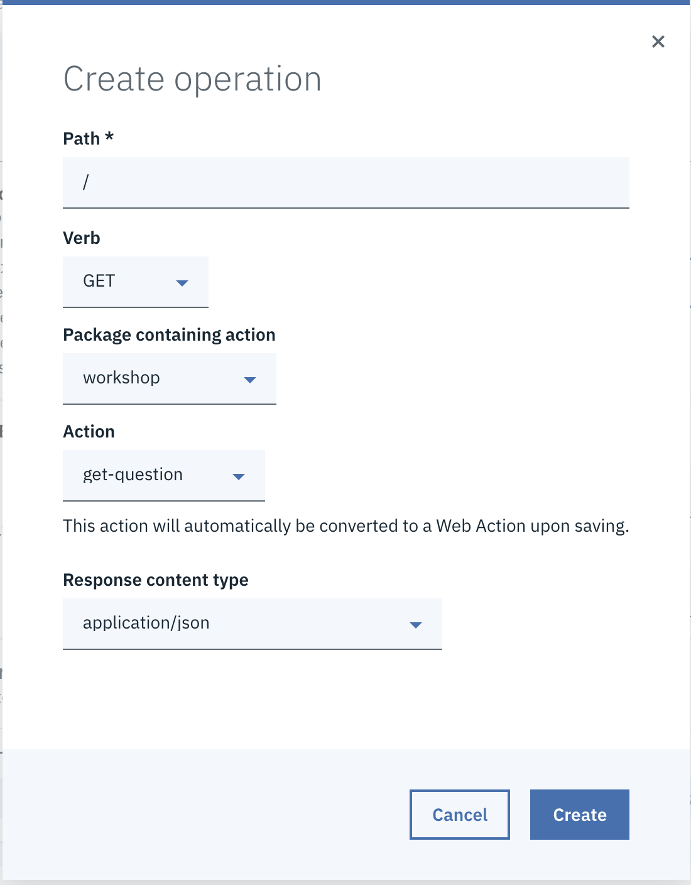
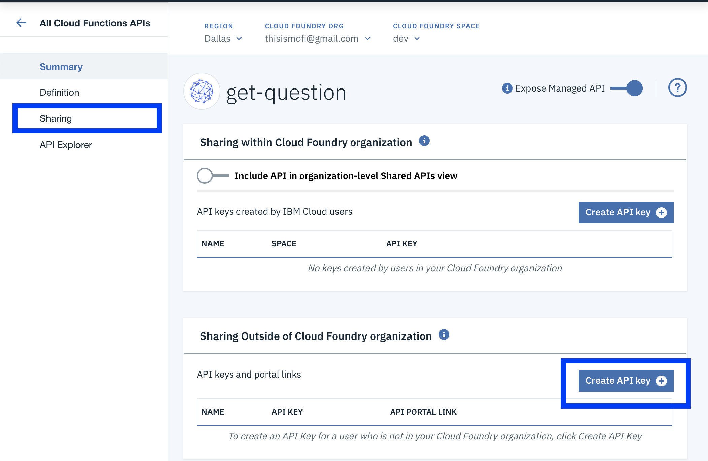

# API Gateway

We have our functions, but how do we use it in our app? API gateway is great way to manage access to our function. 

### Get Question API

* From IBM Cloud dashboard page, go to functions. 


If you are having trouble you can see how to get to functions in the previous step. 


* On the left nav bar the very last tab APIs. Click APIs

* Click on Create a Cloud Functions API
* Give the API a name. First we will create the `get-question` api. Set a base path for the API. Then Click on Create operation.

* In the Create Operation dialog for path just put `/` since we will only have one api at that end point. For verb select get and select the action `get-quesiton` from package `workshop` Response content type is `application/json` 

* Under Security and Rate limiting, Enable application authentication. Set the Method as API Key only.
* Enable rate limiting. For maximum calls select a reasonable number for our application I will assume 20 calls should be ok.
* We will skip OAuth for now, but you can add social login with IBM Cloud App ID, Google, Facebook or Github.
* Finally we will leave CORS enabled. This will allow our react app to call this api.
* From the get-quesiton api page, Click on Sharing on the left nav bar.
* Click on Create API Key on Sharing Outside of Cloud Foundry Organizations section.

* You should give it a name. I will name mine `get-question-api-key` . Click Create.
* Once the api key is created you should see a API Portal Link.

* If you click the API Portal link it will show you the API and how to access it via curl and 7 programming languages including Java, Node, Go, Python. 
* Go to API explorer to find the Endpoint for the API.
* Make a note of the `API Key` and the `API Endpoint` . We will need these for our react application.

### Get All Votes API

Follow above instruction for  create API for get-all-votes function.

### Submit Vote API

You can follow almost all the steps for submit-vote function as well. Just for HTTP verb use POST.

If you are wondering why not get here as well.[ Read This](https://stackoverflow.com/a/46614/10272405).

