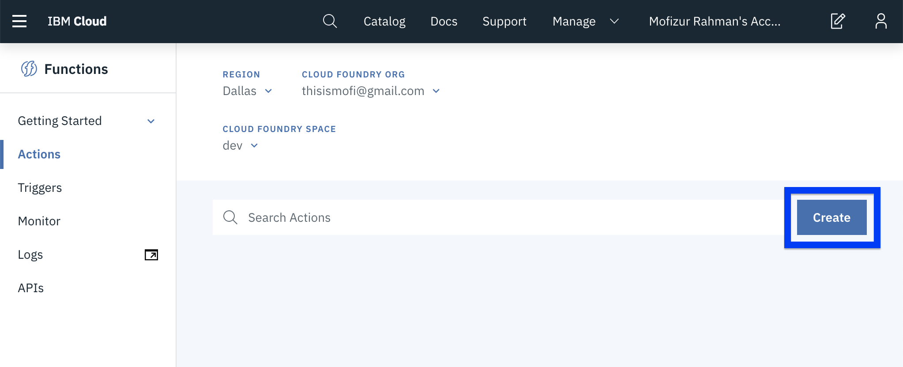

# Create the Functions

In this section we will create our function. We will see how to create function using both the web ui and cli.

## From the Web UI

* Log into[ IBM Cloud](https://cloud.ibm.com)
* Click the top left hamburger.


* Select functions


* Go to actions


* Click on Create 



* Click on Create Actions


* Give the action a name. For out first action we will create `create question` action. We will also put this action in a package called. Package helps us organize our functions. For runtime select Node.js 10



First time you would have to create package to get the package. For any other time, you can find the workshop package in the dropdown


* Click on Create
* This would take us to the editor. 

```javascript
/**
  *
  * main() will be run when you invoke this action
  *
  * @param Cloud Functions actions accept a single parameter, which must be a JSON object.
  *
  * @return The output of this action, which must be a JSON object.
  *
  */
function main(params) {
	return { message: 'Hello World' };
}

```

* We can invoke this action by clicking the Invoke button. 
* We can also change input to pass in a params.
* We can set default parameters from `Parameters` tab on the left.

